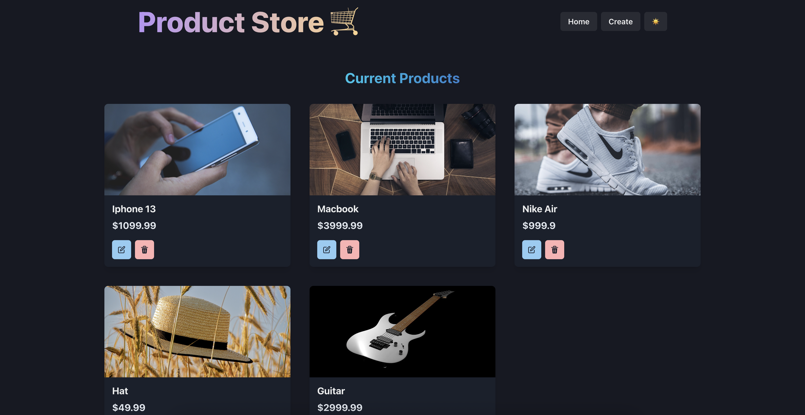
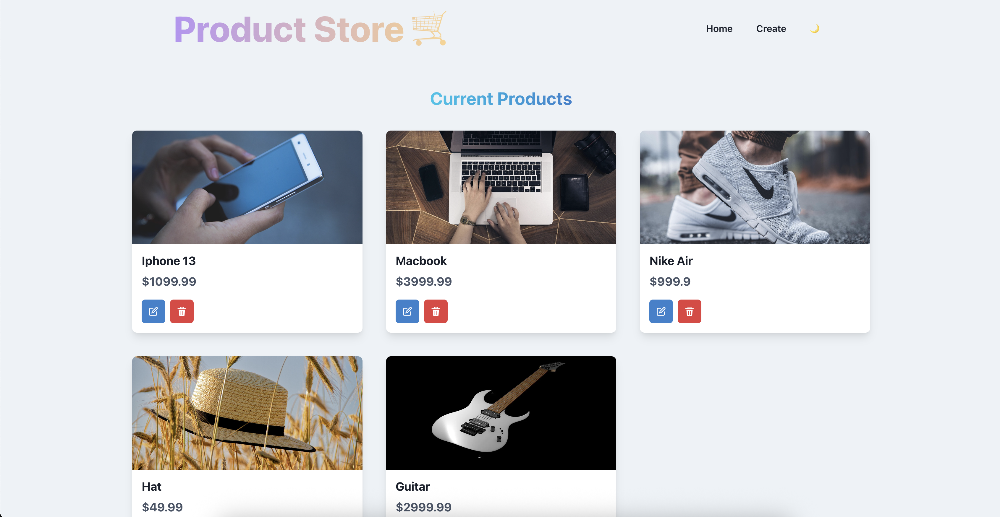
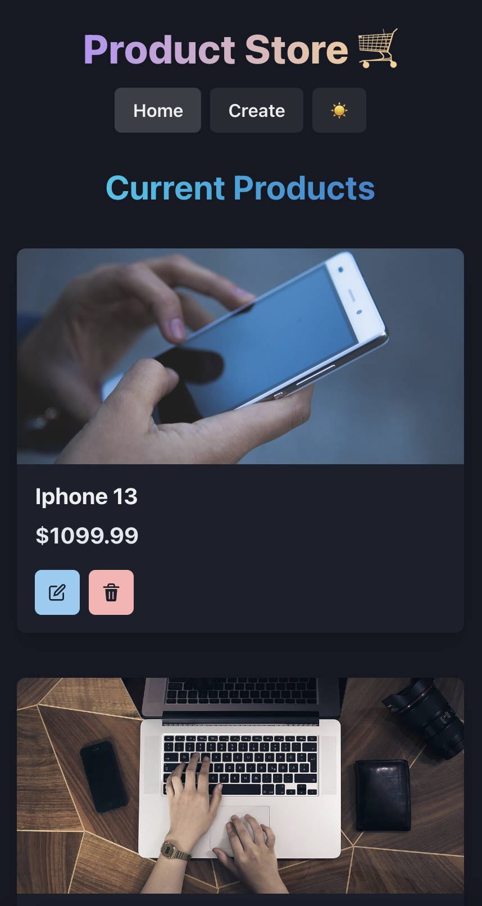
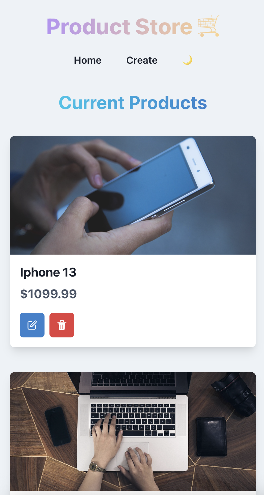

# MERN - Product Store


A simple MERN project built with **React Vite**, **Node.js**, and **MongoDB**.
This application provides a full CRUD system for managing products with a modern and responsive UI.
---
## Screenshots
|  Desktop Dark Home Page |  Desktop Light Home Page | Desktop Dark Create Page | Desktop Light Create Page |
|-------------------|-------------------|-------------------|-------------------|
|  | | | |

|  Mobil Dark Home Page |  Mobil Light Home Page | Mobil Dark Create Page | Mobil Light Create Page |
|-------------------|-------------------|-------------------|-------------------|
|  | | | |

---
## Features
### Backend
- Add a new product  
- Get all products 
- Update a product by ID  
- Delete a product by ID  
- MongoDB integration with Mongoose  
- Tested with Postman  

### Frontend
- Built with React.js and Chakra UI
- Product list with responsive design
- Add, update, and delete products directly from the UI
- User-friendly design with Chakra components & icons
---

## Tech Stack
- **Frontend:** [React vite](https://vite.dev/) with [Chakra-ui](https://chakra-ui.com/)
- **Backend:** [Node.js](https://nodejs.org/), [Express.js](https://expressjs.com/)  
- **Database:** [MongoDB](https://www.mongodb.com/) with [Mongoose](https://mongoosejs.com/)  
- **Testing:** [Postman](https://www.postman.com/)  
---

## Installation & Setup

1. Clone the repository  
    `git clone https://github.com/kadrzeybek/MERN-product_store.git`

2. Create a .env file in the root directory
    ```
    MONGO_URI=mongodb://localhost:27017/example
    PORT=5000
    ```
    
3. Install dependencies in the root directory
    `npm run build` --> this code will downloads all dependencies and creates a dist doc for running frontend and backend together
   
4. Start The Server in the root directory
    `npm run start`